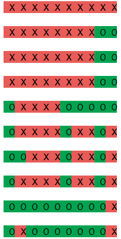

# Python Maze Generator
A Python script that creates a Maze in a nested list from user inputs.

## Installation and Requirements
Save the file MazeGenerator.py and import the function in another file.

The only requirement that is optional is Colorama but it is highly recommended for clarity.

```bash
pip install colorama
```

## Usage
MazeGenerator requires five parameters to function:

```python
create_maze(height, width, maxlength, tunnelcount, colour)
```


* *height*: The vertical length of the nested list.

* *width*: The horizontal length of the nested list.

* *maxlength*: The maximum length a newly generated path can be.

* *tunnelcount*: The number of paths that you would like to generate.

* *colour*: If set to True: the 'wall' (X) and 'path' (O) values will be red and green respectively.

## Examples

```python
create_maze(10, 10, 5, 25, False)
```

gives us:

```python
OXXXXXXXOX

OXXXXXXXOX

OXXXXXXXOX

OOOXXXXXOX

OOOOOOOOOX

OOXXXXXXOX

OOOOOOOOOO

OOOXXXXXXX

OOOXXXXXXX

OOOXXXXXXX
```


```python
create_maze(10, 10, 5, 25, True)
```

gives us:



*This screenshot was taken from a Jupyter Notebook file.*
